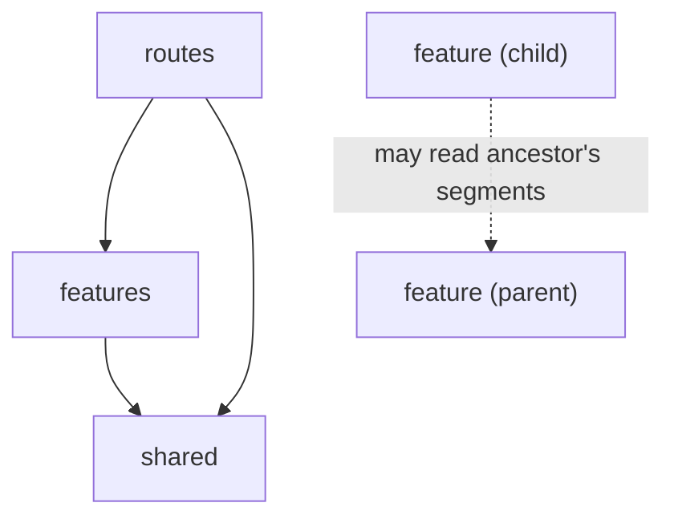

# Frontend Architecture

> Sibling features never import each other. Anything two siblings share
> lives in their nearest common parent feature, and `routes/` puts screens
> together.

The frontend (`apps/frontend/src`) is split into three areas. Every file has one home.

## The three areas

```
apps/frontend/src/
├─ shared/      shadcn UI, helpers, clients for the outside world
├─ features/    one folder per capability (can nest, see below)
└─ routes/      Ionic routing, page layouts, screen assembly
```

| Area | Holds | Examples |
| --- | --- | --- |
| `shared/` | Feature-agnostic UI (`ui/`) and helpers (`lib/`). Never contains business types, stores, or domain logic. | `Button`, `cn` |
| `features/*` | One folder per capability. A feature is the four segments below, child feature folders, or both. See "Nested features." | `groceries`, `groceries/kitchen`, `groceries/recipes`, `groceries/shopping-list` |
| `routes/` | The route table, tabs, and page layouts. Imports whichever leaf feature(s) a screen needs. | route definitions, tab bar, page shells |

## Nested features

A feature folder can hold child feature folders instead of (or alongside)
its own segments. When two or more sibling features need the same store,
business rule, or type, it moves up to their nearest common parent feature,
not out to `shared/`. `shared/` is reserved for things with no domain
knowledge at all (UI kit, generic helpers); it's never a place to put a
type or store just because more than one feature reads it.

A parent feature typically ends up holding `state/`, `logic/`, and
`types.ts` directly, with its children holding only `ui/`:

```
features/groceries/
├─ types.ts             GroceryItem, GroceryLocation, Recipe, Quantity
├─ state/                grocery-store.ts, category-cache-store.ts, ...
├─ logic/                categories.ts, recipe-usage.ts, item-search.ts, ...
├─ kitchen/               ui/ only: ingredient inventory screen
│  └─ ui/
├─ recipes/               ui/ only: recipe management + this-week strip
│  └─ ui/
└─ shopping-list/         ui/ only: shopping list screen
   └─ ui/
```

`item-search.ts` is the clearest example of why this beats a flat
`shared/`: it searches every `GroceryItem`, kitchen and shopping list
alike, to power both the shopping list's "add or search" and the recipe
ingredient picker. It isn't owned by `kitchen` or `shopping-list`
individually. It's owned by `groceries`, their common parent, where it
sits next to the store it reads without the children knowing about each
other.

This nests as deep as needed. If `recipes` later grows its own
sub-concepts that need to be split further, it becomes a parent in turn.

## Import rules

Imports only point downward, and never sideways across siblings:



- `shared/` imports only `shared/`.
- A feature may import its own ancestors' `state/`/`logic/`/`types.ts` (never their `ui/`) via relative path. This is the normal way a child reads the parent it lives in.
- Sibling features, whether top-level (`kitchen` vs `shopping-list`) or nested (two children of the same parent), never import each other, at any depth.
- An ancestor must never import from a descendant. If a parent's store needed something from a child's `ui/`, that's a sign the file is in the wrong place. The dependency direction should never invert.
- Import a leaf feature through its barrel, `@/features/<path>` (e.g. `@/features/groceries/kitchen`). Deep imports are fine from `@/shared/*`.
- Inside a feature, including a child reaching an ancestor's segments, use relative paths.

## The four segments

Each feature (or feature node, in a nested tree) can have the same four segments inside it:

| Segment | Holds |
| --- | --- |
| `ui/` | React components |
| `boundary/` | calls to the Encore backend, Capacitor native plugins, local storage |
| `state/` | Zustand stores and hooks, plus the constant data they are seeded from |
| `logic/` | the business rules: pure, framework-free functions |

Edge cases:

- `boundary/` is anything that crosses out of the app: network calls, the native bridge, persistence. Purpose decides, so a cached copy of the API client still counts as boundary.
- `crypto.randomUUID` and `Date.now` look impure but never leave the process, so they stay in `logic/`.
- A file that mixes segments gets split: a pure function next to a hook, or a store with an inline fetch, becomes two files.
- A leaf feature (no children) usually only needs `ui/` once its state/logic has moved up to a parent. That's expected, not a smell.

The `index.ts` barrel and a root `types.ts` sit outside the segments. Tests sit next to the files they test.

## Placing a new file

1. shadcn component or generic helper, no domain knowledge → `shared/{ui,lib}`
2. Client for the backend or a native plugin → the nearest feature's `boundary/`
3. Store, business-rule function, or type used by only one feature → that feature's own segment
4. Store, business-rule function, or type used by 2+ sibling features → their nearest common parent feature's segment
5. Route, tab, or page layout → `routes/`
6. Anything else → `features/<path>/`, then pick a segment
