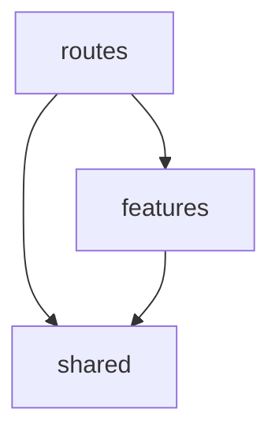

# Frontend Architecture

> Features never import each other. Anything they share lives in `shared/`,
> and `routes/` puts the screens together.

The frontend (`apps/frontend/src`) is split into three areas. Every file has one home.

## The three areas

```
apps/frontend/src/
├─ shared/      shadcn UI, helpers, clients for the outside world
├─ features/    one folder per capability
└─ routes/      Ionic routing, page layouts, screen assembly
```

| Area | Holds | Examples |
| --- | --- | --- |
| `shared/` | Feature-agnostic code: shadcn in `ui/`, helpers in `lib/`, backend and native-plugin clients in `boundary/`. | `Button`, `cn`, the API client |
| `features/*` | One folder per capability, each with the four segments below. Features never import each other. | `kitchen`, `shopping-list` |
| `routes/` | The route table, tabs, and page layouts. Only code here may put two features on the same screen. | route definitions, tab bar, page shells |

## Import rules

Imports only point downward:



- `shared/` imports only `shared/`.
- Import a feature through its barrel, `@/features/<name>`. Deep imports are fine from `@/shared/*`.
- Inside a feature, use relative paths.

## The four segments

Each feature has the same four segments inside it:

| Segment | Holds |
| --- | --- |
| `ui/` | React components |
| `boundary/` | calls to the Encore backend, Capacitor native plugins, local storage |
| `state/` | Zustand stores and hooks |
| `logic/` | the business rules: pure, framework-free functions and constant data |

Edge cases:

- `boundary/` is anything that crosses out of the app: network calls, the native bridge, persistence. Purpose decides, so a cached copy of the API client still counts as boundary.
- `crypto.randomUUID` and `Date.now` look impure but never leave the process, so they stay in `logic/`.
- A file that mixes segments gets split: a pure function next to a hook, or a store with an inline fetch, becomes two files.

The `index.ts` barrel and a root `types.ts` sit outside the segments. Tests sit next to the files they test.

## Placing a new file

1. shadcn component or generic helper → `shared/{ui,lib}`
2. Client for the backend or a native plugin, used by 2+ features → `shared/boundary/`
3. Store read by 2+ features → `shared/state/`
4. Route, tab, page layout, or a screen mixing two features → `routes/`
5. Anything else → `features/<name>/`, then pick a segment
