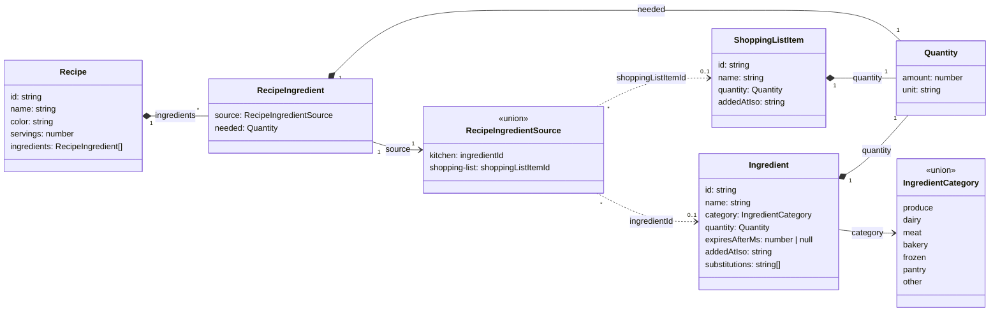

# Kitchen data model

## Semantics the diagram cannot show

- **Expiry** is a duration, not a date: an ingredient expires at
  `addedAtIso + expiresAfterMs`. `null` means it never expires.
- **Quantity's `unit`** is free text (`g`, `bag`, `tub`). `Quantity` lives in
  `shared/types.ts` since both `Ingredient`/`RecipeIngredient` (kitchen) and
  `ShoppingListItem` (shopping list) need it.
- **`substitutions`** are free-text names ("frozen spinach", "kale"), not
  links to other `Ingredient` records. An ingredient can list a substitute
  that is not in the kitchen.
- **`RecipeIngredientSource`** is a tagged union, not a class with both
  fields present at once:
  `{ kind: 'kitchen'; ingredientId: string } | { kind: 'shopping-list';
  shoppingListItemId: string }`. A recipe ingredient you already have in
  your kitchen points at an `Ingredient`; one you don't have yet points at a
  `ShoppingListItem`. Nothing is faked into the kitchen just because a
  recipe needs it — the source tells you which bucket it's really in.
- **Deleting a recipe never cascades.** It only removes the `Recipe`. Any
  `Ingredient` or `ShoppingListItem` it referenced stays exactly as it was,
  even if no other recipe references it anymore — that case is only
  surfaced as an informational warning before the delete (see
  `docs/architecture.md` for where that logic lives:
  `kitchen/logic/recipe-usage.ts`).
- **`ShoppingListItem`** lives in `shared/state/shopping-list-store.ts`, not
  inside the `kitchen` feature, because the `kitchen` feature (recipe
  ingredients) needs to read it and features never import each other. There
  is no shopping-list screen yet — the store exists only to back recipe
  ingredient selection.
