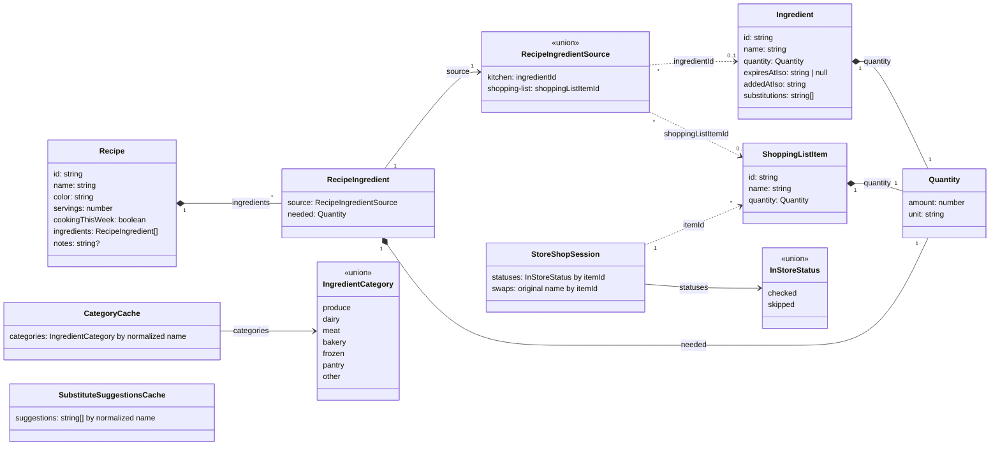

# Data model

Every type and store on this page lives in `features/groceries/`
(`types.ts`, `state/`, `logic/`, `boundary/`), the parent feature, not
`shared/`.
`Ingredient`/`Recipe`/etc. started out inside a single `kitchen` feature, but
once a `shopping-list` feature needed to read kitchen ingredients and
recipes too (to power its "add or search" recommendations), the whole
non-UI layer moved up to their common parent, `groceries`, rather than out
to the generic `shared/`. `groceries/kitchen`, `groceries/recipes`, and
`groceries/shopping-list` are each pure `ui/` layers over this data. See
`docs/architecture.md` for the nested-feature rule this follows. The one
exception is `StoreShopSession` below: only `groceries/store-mode` reads
it, so its store stays down in that child's own `state/` (the same
placement rule, pointing the other way).

## Semantics the diagram cannot show

- **Expiry** is an absolute instant: an ingredient expires at
  `expiresAtIso`, and `null` means it never expires. The preset chips
  ("expires after buying") compute it from `addedAtIso` plus a
  per-category number of days; the date input stores the picked date
  directly.
- **Quantity's `unit`** is free text (`g`, `bag`, `tub`).
- **`substitutions`** are free-text names ("frozen spinach", "kale"), not
  links to other `Ingredient` records. An ingredient can list a substitute
  that is not in the kitchen. The backend's `suggestions` service
  recommends two or three substitutes through an LLM, fetched automatically when
  the ingredient sheet opens with nothing cached for that name. Results
  are cached per normalized ingredient name in `SubstituteSuggestionsCache`
  (an in-memory map inside `groceries/state/use-substitute-suggestions.ts`,
  living for the app session, not across restarts); a reopened sheet
  serves the cached set as-is (no background refresh that would swap
  chips mid-view), and a new fetch only happens on demand from the sheet's
  refresh action. A
  suggestion only becomes ingredient data when the user taps it. Tapping
  adds it through the same `addSubstitution` path as a typed entry, so
  `Ingredient` never gains a "suggested" state.
- **`RecipeIngredientSource`** is a tagged union, not a class with both
  fields present at once:
  `{ kind: 'kitchen'; ingredientId: string } | { kind: 'shopping-list';
  shoppingListItemId: string }`. A recipe ingredient you already have in
  your kitchen points at an `Ingredient`; one you don't have yet points at a
  `ShoppingListItem`. Nothing is faked into the kitchen just because a
  recipe needs it. The source tells you which bucket it's really in.
- **Deleting a recipe never cascades.** It only removes the `Recipe`. Any
  `Ingredient` or `ShoppingListItem` it referenced stays exactly as it was,
  in the kitchen or on the shopping list, even if no other recipe
  references it anymore. That's not treated as a consequence worth warning
  about; the delete confirmation is a plain "Delete this recipe?".
- **Deleting an `Ingredient` that a recipe depends on migrates that recipe's
  source instead of leaving it dangling.** Each affected `RecipeIngredient`
  is repointed from `{kind: 'kitchen', ingredientId}` to
  `{kind: 'shopping-list', shoppingListItemId}`, reusing an existing
  `ShoppingListItem` with the same name if one exists, or creating one
  (seeded with the deleted ingredient's own quantity) if not. Each recipe
  keeps its own `needed` amount through the move. This isn't a cascading
  delete: it's the same "have it vs. need it" transition
  `RecipeIngredientSource` already models everywhere else. This logic lives
  in `DeleteIngredientButton` (the UI layer), not inside `kitchen-store`'s
  `deleteIngredient` action. `kitchen-store` and `shopping-list-store`
  never import each other, so anything that needs both stores is orchestrated
  from a component, the same way `RecipeIngredientPicker`'s "create new"
  flow already does.
- **`useKitchenStore`** (`groceries/state/kitchen-store.ts`, covering both
  `Ingredient` and `Recipe`) and **`useShoppingListStore`**
  (`groceries/state/shopping-list-store.ts`) are siblings in
  `groceries/state/`, read by more than one child: `groceries/recipes`'
  ingredient picker reads the shopping list, and `groceries/shopping-list`'s
  "add or search" reads kitchen ingredients and recipes (to show
  "In kitchen" / "Needed by \<recipe\>"). No child feature imports another
  child. They only read their shared parent's `state/`/`logic/`.
- Deleting a `ShoppingListItem` never cascades either, so a recipe can end up
  with a dangling `shopping-list` source, the same rule as deleting a recipe,
  just in reverse.
- **`cookingThisWeek`** is a plain flag on `Recipe`, not a computed date
  window. It's toggled by hand from the recipe detail sheet and drives which
  recipes appear in the Home page's this-week strip. There's no "week"
  concept or date math backing it.
- **In-store `statuses` only record deviations.** A `ShoppingListItem`
  with no entry is pending. `checked` and `skipped` are the only stored
  values, and the whole map is cleared when a shop completes, so between
  shops the session is empty rather than a mirror of the list.
- **`StoreShopSession` references items by id only.** Its values are plain
  strings, never object references into the other stores. It lives in
  `groceries/store-mode/state/store-session-store.ts` (persisted as
  `store-session-v1`, so a half-finished shop survives an app restart) and
  never imports the other stores. If an item is removed from the list
  mid-shop, its stale id simply stops matching anything.
- **Completing a shop is the ingredient-delete migration in reverse.** Each
  checked `ShoppingListItem` becomes a kitchen `Ingredient`, reusing an
  existing one with the same name (case-insensitive) or creating one
  carrying the bought quantity, and every `RecipeIngredient` pointing at
  it is repointed from `{kind: 'shopping-list', shoppingListItemId}` to
  `{kind: 'kitchen', ingredientId}`, keeping each recipe's own `needed`
  through the move. Only then is the list item removed; skipped and pending
  items stay on the list. Like the delete flow, this is orchestrated from a
  component (`CompleteShopButton`), never inside a store.
- **Categories are derived, never stored.** Kitchen sections and in-store
  aisles are both grouped at render time by resolving each name through
  `CategoryCache`, falling back to `inferCategory(name)` keywords for
  names the LLM hasn't answered yet. Neither `Ingredient` nor
  `ShoppingListItem` has a category field, so the same name lands in the
  same section everywhere, and renaming an item re-categorizes it
  automatically.
- **`CategoryCache` is how LLM inference stays synchronous at render.**
  It's a persisted map (`groceries/state/category-cache-store.ts`, stored
  as `category-cache-v2` and seeded with the demo kitchen's categories)
  from normalized name to `IngredientCategory`, filled asynchronously by
  the Encore `suggestions` service through
  `groceries/boundary/suggestions-api.ts`, the first thing in this app
  that leaves the device. Reads always resolve instantly (cache hit, else
  keyword guess); the LLM answer lands later and re-renders whatever
  derives from it. Offline, or on any failed call, the keyword result
  simply stands. The kitchen and in-store screens request only names the
  cache is missing, and picking a category in the ingredient sheet writes
  straight into the cache under the ingredient's name. Expiry defaults
  are keyword-guessed once at creation and never revisited by a late
  category change.
- **In-store alternatives rename in place.** Substitutes for a list item
  come from the same-named kitchen ingredient's `substitutions`; picking
  one renames the `ShoppingListItem` (`renameItem`), keeping its id so
  recipe sources and its in-store status survive, though the new name may
  move it to a different aisle.
- **Swaps are undoable until the shop completes.** The session's `swaps`
  map remembers each item's name from before its first swap (chained swaps
  keep the original, so Undo always restores what the shopper first wanted).
  Undo renames the item back and drops the record: a component
  orchestration across both stores, like the swap itself. Completing a shop
  clears `swaps` along with `statuses`.
- Loyalty cards are hardcoded display data
  (`store-mode/logic/loyalty-cards.ts`), not part of this model: no store,
  no persistence, just a constant list whose first entry is treated as the
  likely store.
