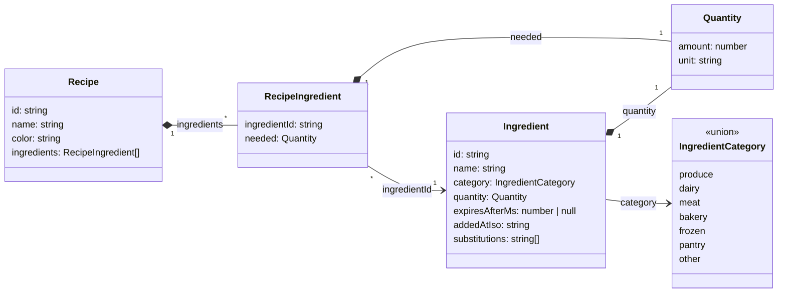

# Kitchen data model

## Semantics the diagram cannot show

- **Expiry** is a duration, not a date: an ingredient expires at
  `addedAtIso + expiresAfterMs`. `null` means it never expires.
- **Quantity's `unit`** is free text (`g`, `bag`, `tub`).
- **`substitutions`** are free-text names ("frozen spinach", "kale"), not
  links to other `Ingredient` records. An ingredient can list a substitute
  that is not in the kitchen.