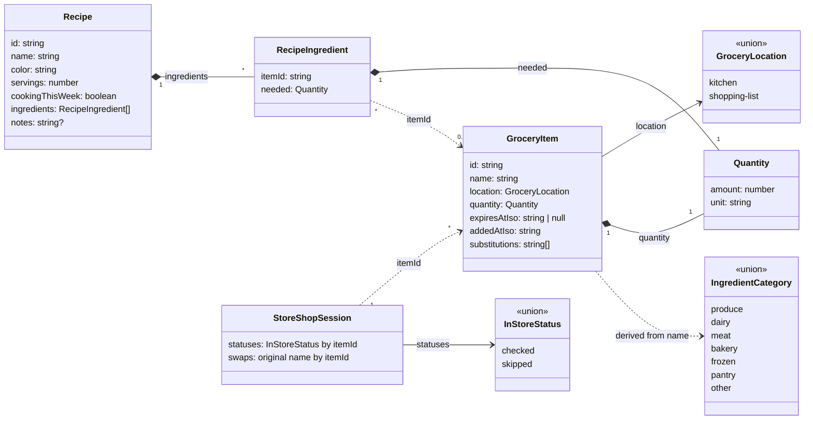

# Data model

Every type and store on this page lives in `features/groceries/`
(`types.ts`, `state/`, `logic/`, `boundary/`). Its child features
(`kitchen`, `recipes`, `shopping-list`) are pure `ui/` layers over this
shared data. `StoreShopSession` is the exception: only
`groceries/store-mode` reads it, so it lives in that child's own
`state/`. See `docs/architecture.md` for the nested-feature rule.

## Small behaviours that are related to the model. 

- An item's id survives a move between kitchen and shopping list. Recipe
  links and the in-store session reference items by id, so they follow an
  item across the move rather than breaking.
- Expiry is kitchen-only: `expiresAtIso` is null on the list side.
  Entering the kitchen assigns a category-default expiry; leaving clears
  it.
- Deleting a recipe never touches its items. Deleting a kitchen item that
  a recipe still needs moves it to the list instead, merging into a
  same-named list item if one exists. Items and recipes share one store,
  so the merge and its recipe-reference repointing are one atomic action.
- Nothing repoints a recipe when its list item is deleted, so `itemId`
  can dangle; the recipe sheet renders it as "Unknown item".
- A missing `statuses` entry means pending, so the two stored values
  cover three states. The map clears when the shop completes.
- `GroceryItem` has no category. Kitchen sections and store aisles are
  grouped at render by resolving the name through `CategoryCache`, so
  renaming an item re-categorizes it. The cache decouples LLM latency
  from rendering: reads resolve instantly against a keyword guess, and
  the LLM answer fills in and re-renders when it arrives (or never, when
  offline).
- A swap renames the list item in place, keeping its id. `swaps` holds
  the pre-swap name (chained swaps keep the first) so it stays undoable
  until the shop completes.
- Loyalty cards are hardcoded display data, not part of this model.
