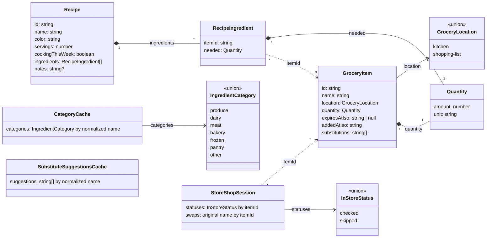

# Data model

Every type and store on this page lives in `features/groceries/`
(`types.ts`, `state/`, `logic/`, `boundary/`), the parent feature, not
`shared/`.
The model started out split across a `kitchen` and a `shopping-list`
feature, but every child feature turned out to read the same items and
recipes (to power search, recipe links, and the in-store view), so the
whole non-UI layer lives up in their common parent, `groceries`, rather
than out to the generic `shared/`. `groceries/kitchen`,
`groceries/recipes`, and `groceries/shopping-list` are each pure `ui/`
layers over this data. See `docs/architecture.md` for the nested-feature
rule this follows. The one exception is `StoreShopSession` below: only
`groceries/store-mode` reads it, so its store stays down in that child's
own `state/` (the same placement rule, pointing the other way).

## Semantics the diagram cannot show

- **"Have it vs. need it" is one field.** A `GroceryItem` whose `location`
  is `kitchen` is an ingredient you have; one on `shopping-list` is
  something to buy. The two sides share one identity: moving an item
  between kitchen and list keeps its id, so recipe links and the in-store
  session survive the move.
- **Expiry** is an absolute instant, and only kitchen items have one: an
  item expires at `expiresAtIso`, and `null` means it never expires (all
  shopping-list items are `null`). `addedAtIso` records when the item
  entered its current location. Entering the kitchen stamps it and
  assigns the item's category default expiry; moving to the list clears
  the expiry. The preset chips ("expires after buying") compute from
  `addedAtIso` plus a per-category number of days; the date input stores
  the picked date directly.
- **Quantity's `unit`** is free text (`g`, `bag`, `tub`).
- **`substitutions`** are free-text names ("frozen spinach", "kale"), not
  links to other `GroceryItem` records. An item can list a substitute
  that is not in the kitchen. The backend's `suggestions` service
  recommends two or three substitutes through an LLM, fetched
  automatically when the ingredient sheet opens with nothing cached for
  that name. Results are cached per normalized name in
  `SubstituteSuggestionsCache` (an in-memory map inside
  `groceries/state/use-substitute-suggestions.ts`, living for the app
  session, not across restarts); a reopened sheet serves the cached set
  as-is (no background refresh that would swap chips mid-view), and a new
  fetch only happens on demand from the sheet's refresh action. A
  suggestion only becomes item data when the user taps it. Tapping adds
  it through the same `addSubstitution` path as a typed entry, so
  `GroceryItem` never gains a "suggested" state.
- **Recipe ingredients point at items by id, wherever they are.**
  `RecipeIngredient.itemId` never changes when an item moves between
  kitchen and list; the "In kitchen" / "On list" badge is derived from
  the item's current `location` at render time.
- **Deleting a recipe never cascades.** It only removes the `Recipe`. Any
  `GroceryItem` it referenced stays exactly where it was, in the kitchen
  or on the shopping list, even if no other recipe references it anymore.
  That's not treated as a consequence worth warning about; the delete
  confirmation is a plain "Delete this recipe?".
- **Deleting a kitchen item that recipes depend on moves it to the
  shopping list instead.** The store's `moveItem` flips the item's
  `location` (keeping id, name, quantity, and substitutions, and clearing
  the expiry), so every `RecipeIngredient` pointing at it is untouched
  and now reads as "on list". If a same-named item already exists at the
  destination, the two merge: the moved record is dropped and its recipe
  references are repointed to the survivor, skipping any entry a recipe
  already has. `DeleteIngredientButton` only chooses between `moveItem`
  (recipes still need it) and `deleteItem` (nothing does).
- **Completing a shop is the same move in reverse.** Each checked item is
  moved into the kitchen: its `addedAtIso` resets to the purchase time,
  the bought quantity is carried, and a category default expiry is
  stamped, or it merges into a same-named kitchen item, which keeps its
  own quantity. Skipped and pending items stay on the list.
  `CompleteShopButton` walks the checked items and then clears the
  session.
- **`useGroceryStore`** (`groceries/state/grocery-store.ts`, persisted as
  `groceries-v1`) holds both items and recipes, so transitions that touch
  both, like `moveItem`'s repointing, are single store actions. Child
  features never import each other; they read this shared parent store.
  Only the swap flow spans two stores (grocery + `StoreShopSession`), and
  that is orchestrated from a component.
- Deleting a shopping-list item never cascades, so a recipe can keep a
  dangling `itemId`. The recipe sheet shows it as "Unknown item", still
  marked on-list.
- **`cookingThisWeek`** is a plain flag on `Recipe`, not a computed date
  window. It's toggled by hand from the recipe detail sheet and drives
  which recipes appear in the Home page's this-week strip. There's no
  "week" concept or date math backing it.
- **In-store `statuses` only record deviations.** A shopping-list item
  with no entry is pending. `checked` and `skipped` are the only stored
  values, and the whole map is cleared when a shop completes, so between
  shops the session is empty rather than a mirror of the list.
- **`StoreShopSession` references items by id only.** Its values are
  plain strings, never object references into the grocery store. It lives
  in `groceries/store-mode/state/store-session-store.ts` (persisted as
  `store-session-v1`, so a half-finished shop survives an app restart)
  and never imports the grocery store. If an item is removed from the
  list mid-shop, its stale id simply stops matching anything.
- **Categories are derived, never stored.** Kitchen sections and in-store
  aisles are both grouped at render time by resolving each name through
  `CategoryCache`, falling back to `inferCategory(name)` keywords for
  names the LLM hasn't answered yet. `GroceryItem` has no category field,
  so the same name lands in the same section everywhere, and renaming an
  item re-categorizes it automatically.
- **`CategoryCache` is how LLM inference stays synchronous at render.**
  It's a persisted map (`groceries/state/category-cache-store.ts`, stored
  as `category-cache-v2` and seeded with the demo kitchen's categories)
  from normalized name to `IngredientCategory`, filled asynchronously by
  the Encore `suggestions` service through
  `groceries/boundary/suggestions-api.ts`, the first thing in this app
  that leaves the device. Reads always resolve instantly (cache hit, else
  keyword guess); the LLM answer lands later and re-renders whatever
  derives from it. Offline, or on any failed call, the keyword result
  simply stands. The kitchen and in-store screens request only names the
  cache is missing, and picking a category in the ingredient sheet writes
  straight into the cache under the item's name. Expiry defaults are
  keyword-guessed once when an item enters the kitchen and never
  revisited by a late category change.
- **In-store alternatives rename in place.** Substitutes for a list item
  come from the same-named kitchen item's `substitutions`; picking one
  renames the list item, keeping its id so recipe links and its in-store
  status survive, though the new name may move it to a different aisle.
- **Swaps are undoable until the shop completes.** The session's `swaps`
  map remembers each item's name from before its first swap (chained
  swaps keep the original, so Undo always restores what the shopper first
  wanted). Undo renames the item back and drops the record: a component
  orchestration across both stores, like the swap itself. Completing a
  shop clears `swaps` along with `statuses`.
- Loyalty cards are hardcoded display data
  (`store-mode/logic/loyalty-cards.ts`), not part of this model: no
  store, no persistence, just a constant list whose first entry is
  treated as the likely store.
