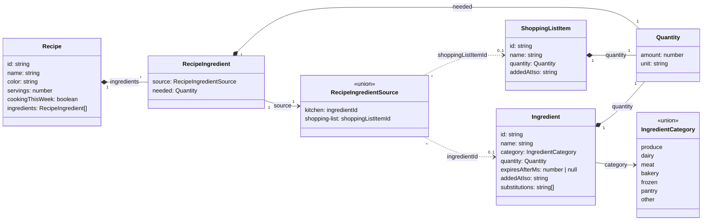

# Data model

Every type and store on this page lives in `features/groceries/`
(`types.ts`, `state/`, `logic/`) — the parent feature, not `shared/`.
`Ingredient`/`Recipe`/etc. started out inside a single `kitchen` feature, but
once a `shopping-list` feature needed to read kitchen ingredients and
recipes too (to power its "add or search" recommendations), the whole
non-UI layer moved up to their common parent, `groceries`, rather than out
to the generic `shared/`. `groceries/kitchen`, `groceries/recipes`, and
`groceries/shopping-list` are each pure `ui/` layers over this data — see
`docs/architecture.md` for the nested-feature rule this follows.

## Semantics the diagram cannot show

- **Expiry** is a duration, not a date: an ingredient expires at
  `addedAtIso + expiresAfterMs`. `null` means it never expires.
- **Quantity's `unit`** is free text (`g`, `bag`, `tub`).
- **`substitutions`** are free-text names ("frozen spinach", "kale"), not
  links to other `Ingredient` records. An ingredient can list a substitute
  that is not in the kitchen.
- **`RecipeIngredientSource`** is a tagged union, not a class with both
  fields present at once:
  `{ kind: 'kitchen'; ingredientId: string } | { kind: 'shopping-list';
  shoppingListItemId: string }`. A recipe ingredient you already have in
  your kitchen points at an `Ingredient`; one you don't have yet points at a
  `ShoppingListItem`. Nothing is faked into the kitchen just because a
  recipe needs it — the source tells you which bucket it's really in.
- **Deleting a recipe never cascades.** It only removes the `Recipe`. Any
  `Ingredient` or `ShoppingListItem` it referenced stays exactly as it was —
  in the kitchen, or on the shopping list — even if no other recipe
  references it anymore. That's not treated as a consequence worth warning
  about; the delete confirmation is a plain "Delete this recipe?".
- **`useKitchenStore`** (`groceries/state/kitchen-store.ts`, covering both
  `Ingredient` and `Recipe`) and **`useShoppingListStore`**
  (`groceries/state/shopping-list-store.ts`) are siblings in
  `groceries/state/`, read by more than one child: `groceries/recipes`'
  ingredient picker reads the shopping list, and `groceries/shopping-list`'s
  "add or search" reads kitchen ingredients and recipes (to show
  "In kitchen" / "Needed by \<recipe\>"). No child feature imports another
  child — they only read their shared parent's `state/`/`logic/`.
- Deleting a `ShoppingListItem` never cascades either, so a recipe can end up
  with a dangling `shopping-list` source — same rule as deleting a recipe,
  just in reverse.
- **`cookingThisWeek`** is a plain flag on `Recipe`, not a computed date
  window. It's toggled by hand from the recipe detail sheet and drives which
  recipes appear in the Home page's this-week strip — there's no "week"
  concept or date math backing it.
